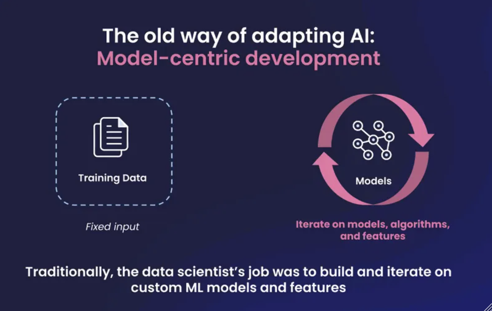

## Introduction
I recently delved into two insightful books: ["Free Your Mind"](https://www.goodreads.com/book/show/121460912-l?from_search=true&from_srp=true&qid=R4FoooIDog&rank=1) and ["The Inner Game of Tennis"](https://www.goodreads.com/book/show/905.The_Inner_Game_of_Tennis). Both have illuminated the idea of constructing systems that foster growth and resilience. Consider the journey of scaling a business from scratch. Typically, it starts with a simple MVP crafted by an entrepreneur. As it gains traction in the market, funding and skilled individuals gravitate towards it, refining and expanding the burgeoning product. Similarly, envision establishing a balanced lifestyle anchored by five tenets: health, family, friends, work, and spirituality. Much like a tennis game, it's about monitoring the system's progress—shedding the ego, trusting one's instincts, continually learning, and adapting. This allows the system to organically find its equilibrium and flourish.

With that in mind, I'm actively applying this philosophy to my exploration of LLM Fine-Tuning. I will share my code and insights in this post.

## Goals
- Learn the new way of adapting AI to accomplish a binary classification task.
- Build a simple framework of LLM fine-tuning.
- Evaluate AI performance with various conditions or optimization techniques (e.g. training data size).
- Compare the new way vs. the traditional way of adapting AI.

## How to fine tune a LLM to accomplish a binary classification task?
I've had fun to generate content by ChatGPT from OpenAI in response to prompts, but how does one train (or fine-tune) a LLM to accomplish a target prediction task? I've tailored a task to predict the sentiments of movie reviews from Rotten Tomatoes, using the [OpenLLaMA](https://github.com/openlm-research/open_llama) which is the permissively licensed open source reproduction of Meta AI's [LLaMA](https://ai.meta.com/blog/large-language-model-llama-meta-ai/) large language model. 

### A simple framework

#### Setup: The following resources are helpful in accomplishing the task.
##### Installation & Download:
✅ Set up Google Cloud with GPU/TPU (Note: I have TPU. EasyLM is built for GPU as well)  
✅ [Install EasyLM](https://github.com/young-geng/EasyLM)  
✅ [Download OpenLLaMA version 3B 2v](https://huggingface.co/openlm-research/open_llama_3b_v2/tree/main?clone=true)  
✅ [Download Rotten Tomatoes data](https://huggingface.co/datasets/MrbBakh/Rotten_Tomatoes)  
##### Common Installation Issues:
```bash
# Error
# https://github.com/huggingface/transformers/issues/19844#issue-1421007669
ImportError: libssl.so.3: cannot open shared object file: No such file or directory

# Resolution
fix: pip install transformers --force-reinstall
```

```bash
# Error
sentencepiece\sentencepiece\src\sentencepiece_processor.cc(1102)

# Resolution
https://github.com/huggingface/transformers/issues/20011
```

#### Step 1: Fine tune the pre-trained model (OpenLLaMA 3B V2) on the target task labeled training dataset.
```bash
# Fine tune Tune a pre-trained model
# total_steps: number of tokens divided by seq_length=1024
python3 -m EasyLM.models.llama.llama_train \
    --total_steps=1846  \
    --save_model_freq=1846 \
    --optimizer.adamw_optimizer.lr_warmup_steps=184 \
    --train_dataset.json_dataset.path='/checkpoint/xinleic/tune/EasyLM/data/rotten_tomatoes/output_dataset_train_90.txt' \
    --train_dataset.json_dataset.seq_length=1024 \
    --load_checkpoint='params::/checkpoint/xinleic/tune/EasyLM/my_models/open_llama_3b_v2_easylm/open_llama_3b_v2_easylm' \
    --tokenizer.vocab_file='/checkpoint/xinleic/tune/EasyLM/my_models/open_llama_3b_v2_easylm/tokenizer.model' \
    --logger.output_dir='/checkpoint/xinleic/tune/EasyLM/my_models/open_llama_3b_v2_easylm_tuned_90'  \
    --mesh_dim='1,4,2' \
    --load_llama_config='3b' \
    --train_dataset.type='json' \
    --train_dataset.text_processor.fields='text' \
    --optimizer.type='adamw' \
    --optimizer.accumulate_gradient_steps=1 \
    --optimizer.adamw_optimizer.lr=0.002 \
    --optimizer.adamw_optimizer.end_lr=0.002 \
    --optimizer.adamw_optimizer.lr_decay_steps=100000000 \
    --optimizer.adamw_optimizer.weight_decay=0.001 \
    --optimizer.adamw_optimizer.multiply_by_parameter_scale=True \
    --optimizer.adamw_optimizer.bf16_momentum=True 
```
#### Step 2: Serve the tuned model.
```bash
# Serve fine-tuned model
# All Llama models use the same tonkenizer 
python3 -m EasyLM.models.llama.llama_serve \
    --load_llama_config='3b' \
    --load_checkpoint='params::/checkpoint/xinleic/tune/EasyLM/my_models/open_llama_3b_v2_easylm_tuned/6680d4286a394c999852dcfe33081c44/streaming_params' \
    --tokenizer.vocab_file='/checkpoint/xinleic/tune/EasyLM/my_models/open_llama_3b_v2_easylm/tokenizer.model'
```
#### Step 3: Evaluate the tuned model on the test dataset.
```bash
# Evaluate it on the test dataset
curl "http://0.0.0.0:5007/generate" \
-H "Content-Type: application/json" \
-X POST --data-binary @/checkpoint/xinleic/tune/EasyLM/data/rotten_tomatoes/eval_output_dataset_test.json | tee /checkpoint/xinleic/tune/EasyLM/data/rotten_tomatoes/eval_output_dataset_test_a4tune.json
```

### Evaluation
To learn how do variables impact the model performance, I did experimentation on the following variables. 
#### Training data size
As training data increases, the model performs better on the same test dataset (size = X rows).
| Sampling ratio | Training data size | Accuracy |
|---------|---------|---------|
| 50%  | 4265  | 50%     |
| 70%  | 5971  | 83.40%  |
| 90%  | 7677  | 88.74%  |
| 100% | 8530  | 87.24%  |


## How is it different from the traditional Data Science way of adapting ML model?
When building the framework and fine-tuning the LLM, I began to consider how this approach differs from the traditional method of developing a binary classifier in ML. The most significant difference is that the new method is data-centric, while the old one is model-centric.


<small>*Fig. 1. The old way of AI/ML development. (Image Source: Snorkel AI)*</small>

<small>*Fig. 2. The new way of AI/ML development. (Image Source: Snorkel AI)*</small>

## References
[1] 

## Next Steps
- The impacts of other parameters in fine-tuning on model performance (e.g. learning rate)
- Investigate misclassified samples to gather insights about data collection & quality
- Exploration of LoRa in excelerating fine-tuning


